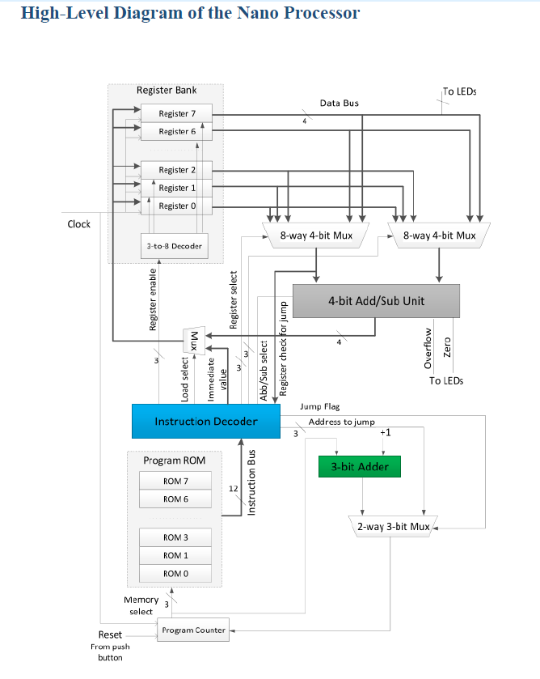
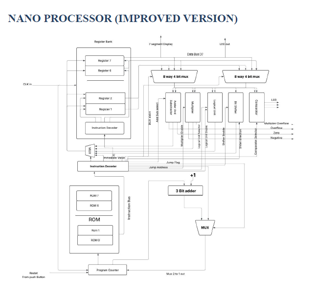

🧠 Nano Processor Design – VHDL Implementation
Welcome to the repository for my Nano Processor project, implemented using VHDL and simulated on the Xilinx Vivado platform. This repository contains modular components of a 4-bit Nano Processor architecture, detailed designs, simulations, timing diagrams, and enhancements.

📌 Table of Contents
- [Introduction](#introduction)
- [Components Design](#components-design)
  - [Program ROM](#program-rom)
  - [Buses](#buses)
  - [Instruction Decoder](#instruction-decoder)
  - [Program Counter](#program-counter)
  - [Register Bank](#register-bank)
  - [Multiplexers](#multiplexers)
  - [4-bit Add/Subtract Unit](#4-bit-addsubtract-unit)
  - [3-bit Adder](#3-bit-adder)
- [Structure of Instructions](#structure-of-instructions)
- [High-Level Diagram of the Nano Processor](#high-level-diagram)
- [Improved Nano Processor](#improved-nano-processor)
- [Detailed Modules and Simulations](#detailed-modules-and-simulations)
- [Clock Generator](#clock-generator)
- [Getting Started](#getting-started)
- [License](#license)

License

🧾 Introduction
This project demonstrates the complete design of a 4-bit Nano Processor from the ground up using VHDL. The design focuses on modularity and includes a fully functional improved version with enhanced instruction decoding and arithmetic operations.

🔧 Components Design
- **Program ROM**  
  Instruction memory for the processor's operation.

- **Buses**  
  Data and control signal pathways between modules.

- **Instruction Decoder**  
  Decodes instruction bits into control signals.

- **Program Counter**  
  Manages the execution flow by addressing instructions.

- **Register Bank**  
  Temporary storage for data processing.

- **Multiplexers**  
  Includes:  
  &nbsp;&nbsp;• 8-Way 4-Bit MUX  
  &nbsp;&nbsp;• 2-Way 3-Bit MUX  
  &nbsp;&nbsp;• 2-Way 4-Bit MUX

- **4-bit Add/Subtract Unit**  
  Performs binary addition and subtraction.

- **3-bit Adder**  
  Used for internal counter and address logic.

📘 Structure of Instructions
&nbsp;Detailed explanation of the binary instruction format used by the processor.

📊 High-Level Diagram
&nbsp;Includes block diagrams for overall system architecture and component interconnection.

🚀 Improved Nano Processor
This version includes:

- **Enhanced ALU with more operations**
- **Optimized control logic**
- **Improved instruction set**

Includes:

- **Design & simulation source files**
- **Elaborated and implemented schematics**
- **Timing

🧪 Detailed Modules and Simulations
Each component in this repo includes:

## 📊 High-Level Diagrams

### 🧩 Basic Nano Processor Architecture

This diagram represents the core structure of the initial Nano Processor design, illustrating how each module communicates and works together to execute instructions.

  
*Figure: High-Level Architecture of the Basic Nano Processor*

> 📌 Includes: Program ROM, Program Counter, Instruction Decoder, Register Bank, ALU, and Multiplexers.

---

### 🚀 Improved Nano Processor Architecture

The improved design adds more functionality, including extended instruction support and enhanced control logic, enabling better performance and versatility.

  
*Figure: High-Level Architecture of the Improved Nano Processor*

> 🆕 Improvements include: Better ALU support (e.g., logical ops), refined instruction decoding, and optimizations in register access.

---

✅ Design Source File

🔍 Elaborated Design Schematic

💻 Simulation Source File

⏱️ Timing Diagram

⏰ Slow Clock
A clock divider for producing a slower clock signal, helpful in simulation and testing.

🛠️ Getting Started
Prerequisites
Xilinx Vivado

Basic understanding of VHDL and digital design

How to Run
Clone the repository:

bash
Copy
Edit
git clone https://github.com/your-username/nano-processor.git
cd nano-processor
Open Vivado and import the source files.

Run elaboration, synthesis, implementation, and simulation.

Use the included testbenches and observe timing diagrams.

📄 License
This project is licensed under the MIT License – see the LICENSE file for details.

🙌 Acknowledgments
Special thanks to the University of Moratuwa and the Department of Computer Science and Engineering for academic support.

